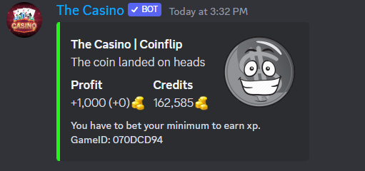
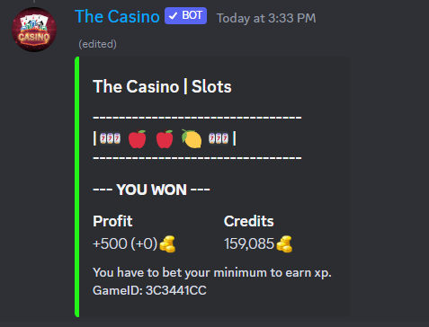
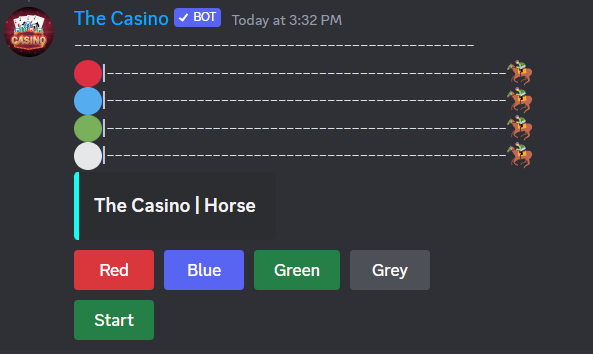
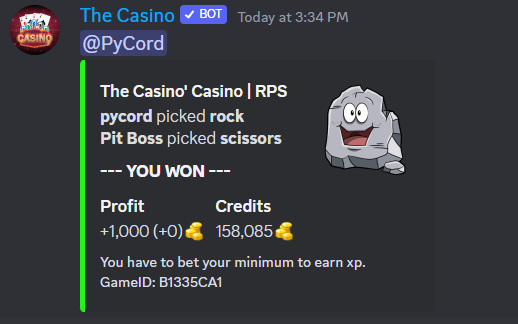
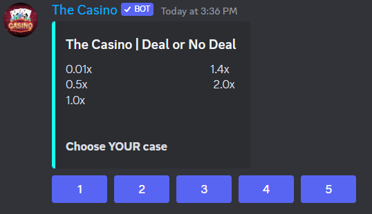
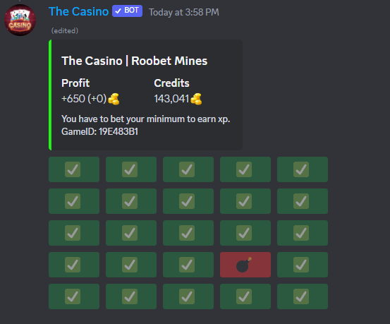
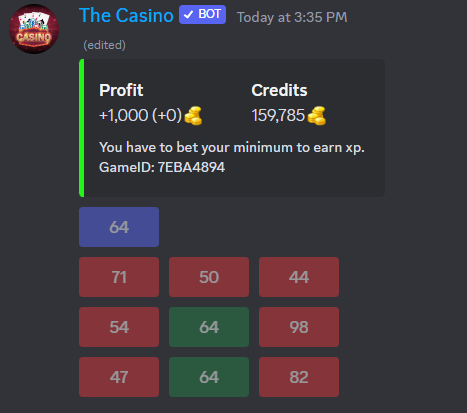

# 🕹 Games

Blackjack

Usage[^1]

Coinflip

Usage[^2]

Slots

Usage[^3]

Roulette

Usage[^4]

Crash

Usage[^5]

Horse

Usage[^6]

Rock Paper Scissors

Usage[^7]

Deal or No Deal

Objective: get highest multiplier. \
Game starts with player picking their case they think the highest multiplier is in.\
They'll then choose cases to reveal.\
\
Dealer will give you an offer based on the revealed multipliers. \
\
You can either accept or decline it.\
\
If declining it, this process will repeat until only 2 cases left. From there, you can either choose to open your case or the last case remaining. Whichever case you open here, will be the multiplier you end with.&#x20;

Usage[^8]

(Roobet) Mines

Sorta like minesweeper.\
Objective: click spaces that aren't a bomb.\
Once you don't want to click anymore, click one of the checkmarks to end the game.

Usage[^9]

Scratch

Scratch offs or scratch tickets, whatever you call them.

Usage[^10]

Rob

[^1]: /blackjack

[^2]: /coinflip

[^3]: /slots

[^4]: /roulette

[^5]: /crash

[^6]: /horse

[^7]: /rockpaperscissors

[^8]: /dond

[^9]: /mines

[^10]: /scratch
