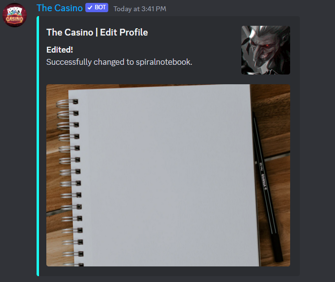

# ℹ Profile

View

Edit

Background Image

/profile edit backgroundimage scroll

/profile edit backgroundimage inkpaper

/profile edit backgroundimage spiralnotebook

Embed Color

/profile edit embedcolor COLOR

Replace "COLOR" with a color

See all colors in /colors\

Text Color

/profile edit textcolor COLOR

Replace "COLOR" with a color

See all colors in /colors\

