# 🧳 Cosmetic Locker

The Cosmetic Locker is The Casino's collection-focused use for Diamonds. The catalog contains **155 permanent unlocks**, including 108 time-limited event pieces. Cosmetics change presentation only: they do not alter odds, payouts, cooldowns, or game power.

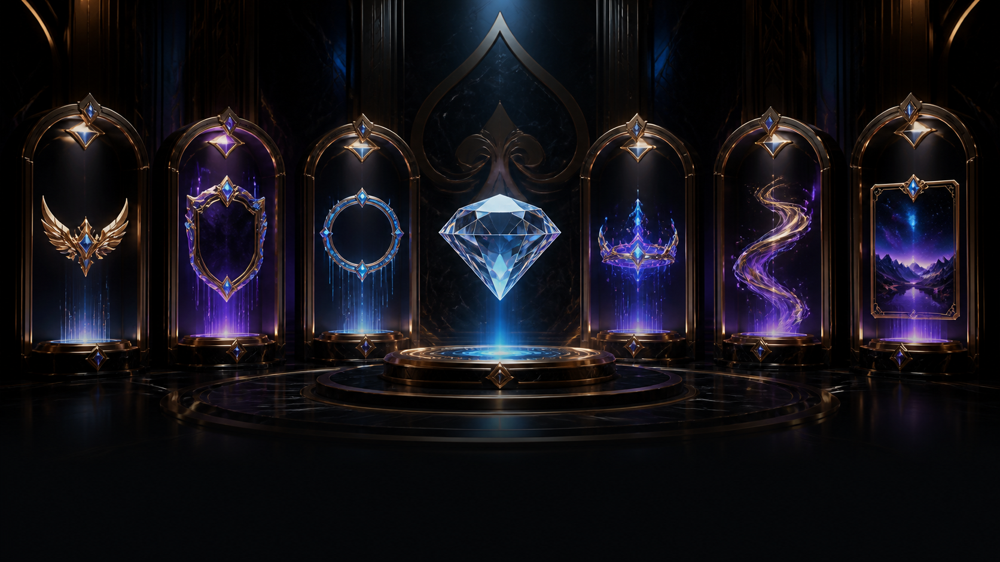

## How it works

1. Enter the interactive Diamond Atelier with `/cosmetics shop [category]`.
2. Unlock an item with `/cosmetics buy <cosmetic>`.
3. The cosmetic is equipped immediately and kept permanently.
4. Swap owned cosmetics for free with `/cosmetics equip`, clear a slot, or use `/cosmetics shuffle` for a surprise look.

Your `/profile view` card and embed display the equipped look. Other players can also see these cosmetics when viewing your public profile.

The Atelier presents one cosmetic at a time with its artwork, edition, price, ownership status, and permanent-unlock details. Use the collection and item menus to jump around, the gallery buttons to browse, and **Unlock** or **Equip** without leaving the display. **My Locker** switches directly to your owned collection, including completion progress, equipped status, shuffle, and clear-slot controls.

Category totals include the complete permanent and event catalog. The shop carousel displays regular pieces, currently active event pieces, and timed pieces you already own. Use `/cosmetics seasons` to explore every vaulted or active event cosmetic year-round.

## Cosmetic slots

| Slot | What it changes | Current price range |
| --- | --- | ---: |
| Title | A named identity beneath your profile name | 150–300 💎 |
| Crest | A collectible emblem in the profile embed | 125 💎 |
| Frame | A colored border around the profile card | 250–400 💎 |
| Aura | An animated-feeling emoji treatment around the profile title | 175–225 💎 |
| Tagline | A short personality line in the profile embed | 100 💎 |
| Tracker | Chooses the stat featured on the profile | 100 💎 |
| Background | An original illustrated profile-card scene | 500 💎 |
| Emblem | A collectible icon displayed beneath earned achievements | 175–400 💎 |

The first background collection contains **Neon Penthouse**, **Sunken Vault**, and **Celestial Casino**.

The first emblem collection contains **Royal Flush**, **Diamond Oracle**, **Gilded Vault**, **Lucky Seven**, **Inferno Chip**, **Cosmic Roulette**, **Sapphire Serpent**, **Winged Ace**, **Midnight Shark**, and **Platinum Jackpot**. Every unlocked emblem appears automatically on `/profile view`, beneath earned achievement icons.

## Commands

| Command | Usage |
| --- | --- |
| `/cosmetics shop [category]` | Browse all cosmetics or filter one slot. |
| `/cosmetics buy <cosmetic>` | Unlock and equip the selected cosmetic. |
| `/cosmetics locker` | See owned cosmetics and equipped status. |
| `/cosmetics equip <cosmetic>` | Equip an owned cosmetic for free. |
| `/cosmetics clear <slot>` | Clear one slot without losing ownership. |
| `/cosmetics shuffle` | Equip one random owned cosmetic in every available slot. |
| `/cosmetics collection` | Open the owned collection directly at the emblem gallery. |
| `/cosmetics sets` | View coordinated set progress and claim cosmetic identity rewards. |
| `/cosmetics seasons` | Enter the visual Seasonal Vault and browse all 9 events and 108 timed pieces. |

## Collection sets and rewards

| Set | Required pieces | Reward |
| --- | --- | --- |
| Neon Royalty | High Roller, Amethyst Frame, Starlight Aura, Neon Penthouse | Neon Curator title |
| Vault Society | Vault Royalty, Vault Keeper, High Roller Gold Frame, Sunken Vault | Vault Archivist title |
| Celestial Circle | Diamond Hands, Diamond Glow, Level Showcase, Celestial Casino | Celestial Patron title |

Ten completed achievements unlock the **Achievement Hunter** title. Eligible players can also claim active seasonal identity rewards through `/cosmetics sets`. Reward titles cannot be purchased, but remain permanently owned after they are earned. These rewards remain cosmetic-only.

## Seasonal Vault

Event availability controls **when a cosmetic can be acquired**, never when it can be used. Once a piece enters your Locker, it remains usable throughout the year.

`/cosmetics seasons` is an interactive gallery rather than a text index. Choose an event, select any of its 12 pieces, inspect its artwork and profile slot, and see whether it comes from Diamonds, a donator claim, or the Casino Pass. Vaulted pieces remain visible there so collectors can plan for their return.

Each collection contains 12 original designs scattered across titles, badges, frames, auras, taglines, and trackers:

* **6 Casino Pass exclusives** distributed from free through Platinum milestones.
* **4 Diamond unlocks** available to every player during the event window.
* **2 donator-only claims** available during the same window without a Diamond charge.

| Collection | Annual acquisition window | Theme |
| --- | --- | --- |
| 🎆 Midnight New Year | December 26–January 10 | Fireworks, countdowns, champagne gold, and midnight celebration |
| 💘 Velvet Valentine | January 25–February 18 | Velvet hearts, roses, love letters, and romantic casino glamour |
| 🍀 Emerald Fortune | March 1–March 20 | Clover luck, emeralds, rainbows, and Celtic casino magic |
| 🌸 Spring Garden Gala | March 1–May 31 | Easter, blossoms, garden magic, and spring casino pieces |
| ☀️ Summer High-Roller Resort | June 1–August 31 | Tropical resort, ocean, sunset, and summer-night pieces |
| 🎇 Midsummer Fireworks Festival | June 20–July 10 | Fireworks, sparklers, neon night skies, and festival energy |
| 🎃 Autumn Haunted House | September 1–November 7 | Harvest, Halloween, candlelight, and haunted casino pieces |
| 🦃 Harvest High-Roller Feast | November 1–November 30 | Thanksgiving tables, autumn abundance, pies, and harvest gold |
| ❄️ Winter Royal Casino | November 20–January 10 | Christmas, snow, aurora, gifts, and winter casino pieces |


Missing a window means waiting for that collection's next annual return. Previously collected pieces are never removed or disabled.


### Midnight New Year

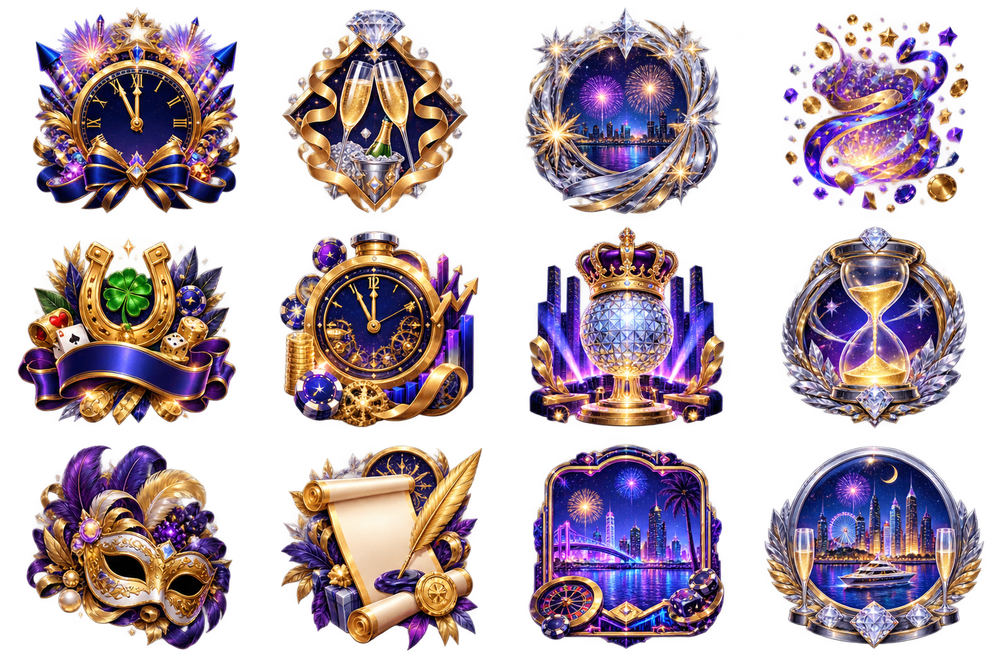

### Velvet Valentine

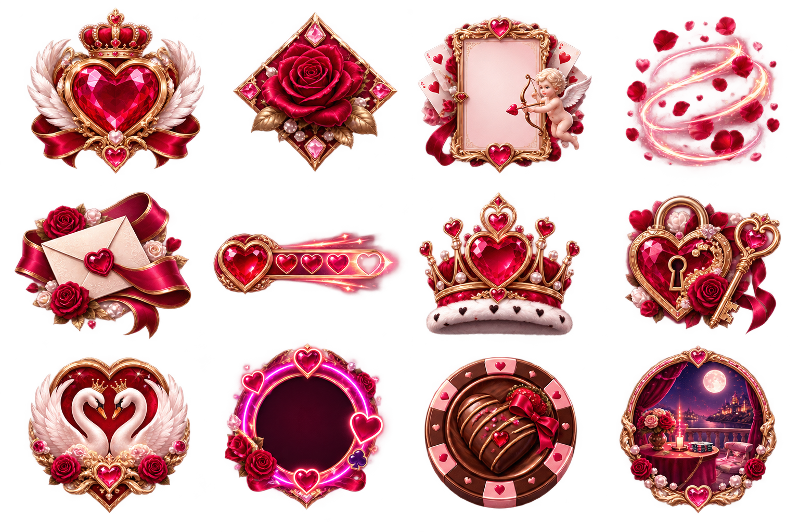

### Emerald Fortune

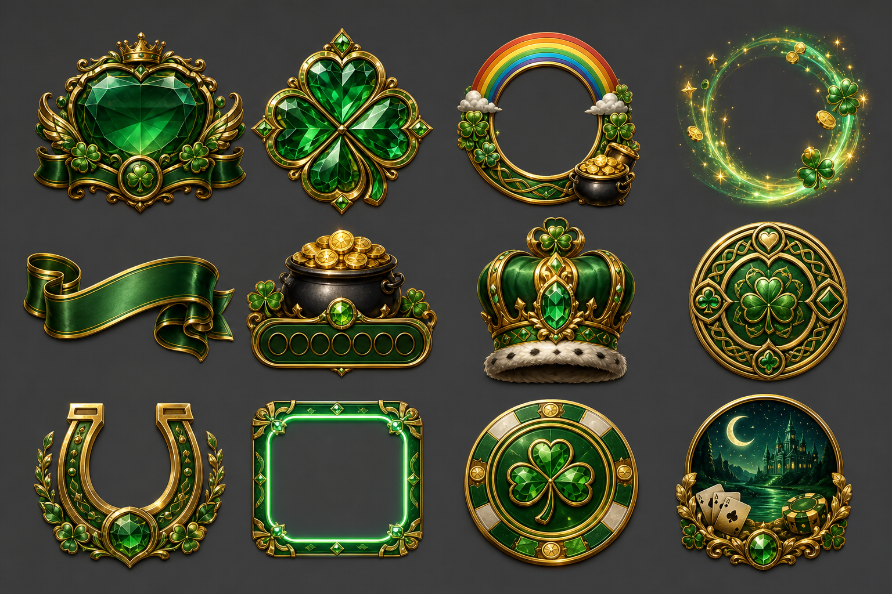

### Spring Garden Gala

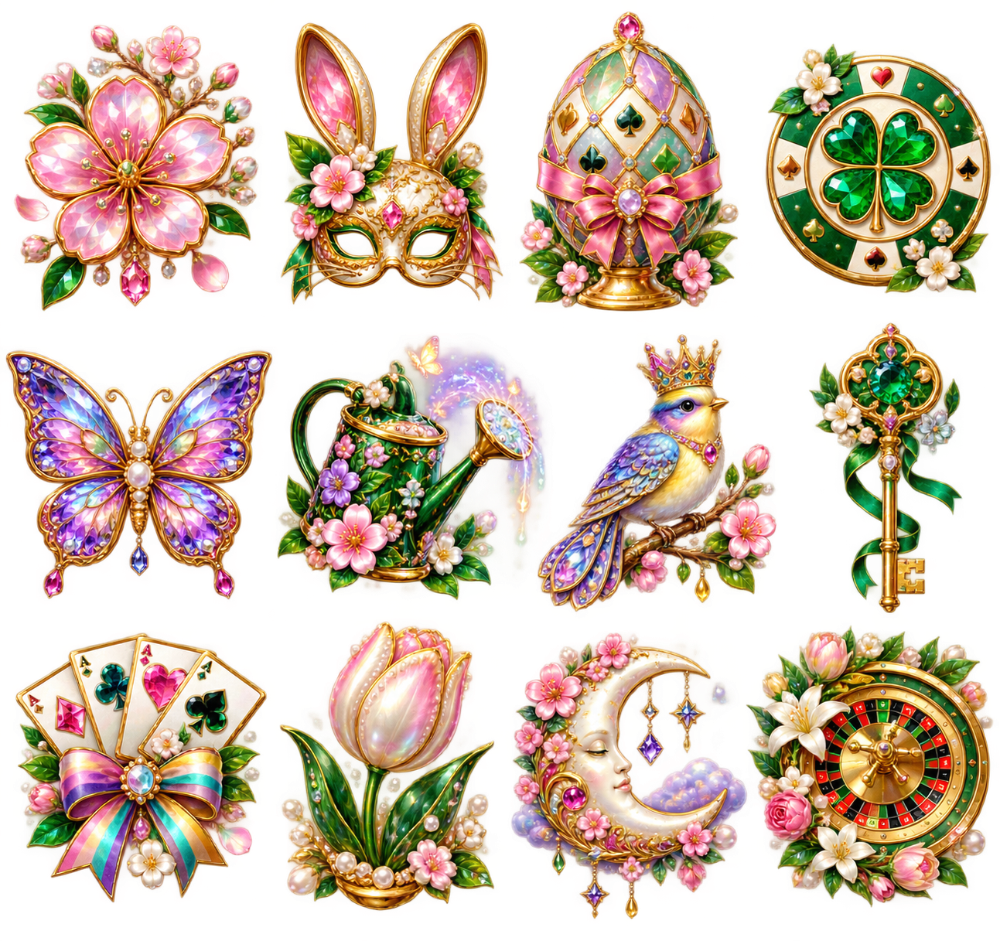

### Summer High-Roller Resort

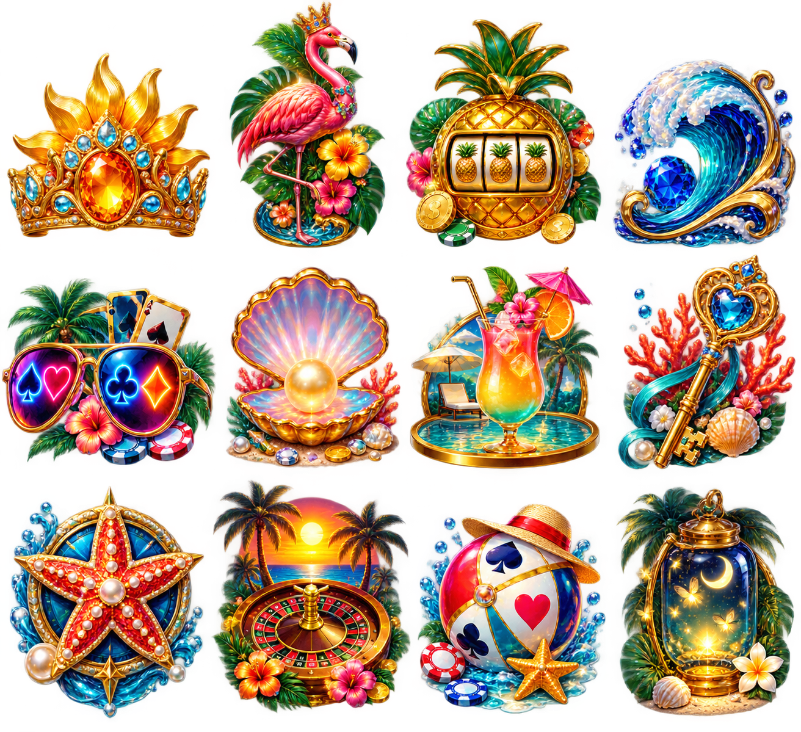

### Midsummer Fireworks Festival

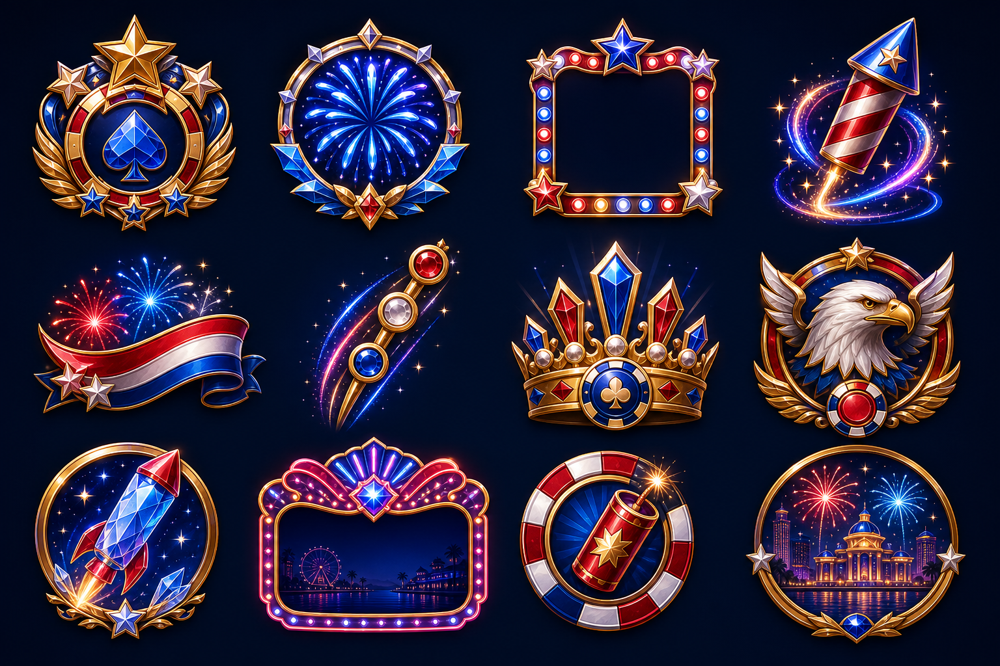

### Autumn Haunted House

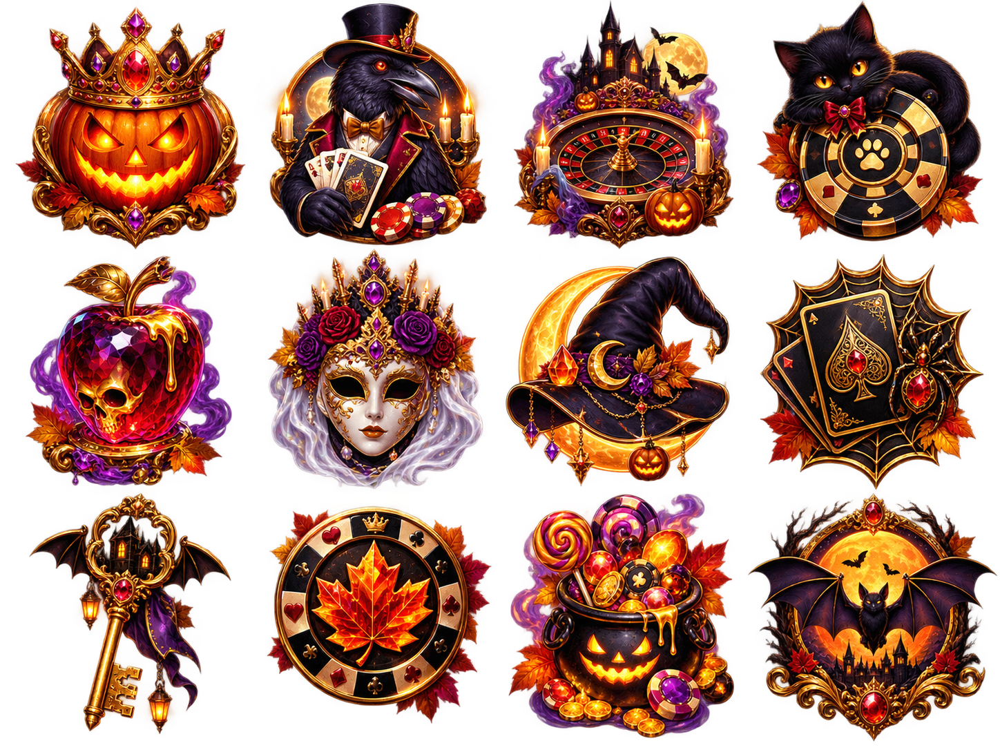

### Harvest High-Roller Feast

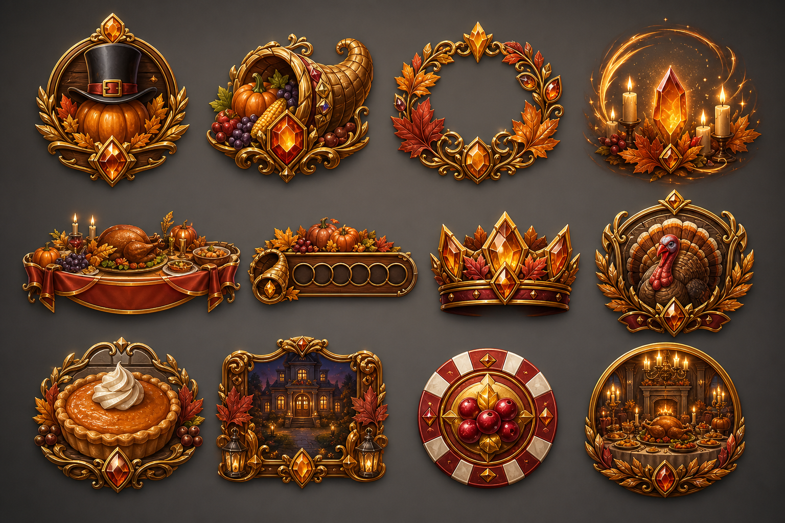

### Winter Royal Casino

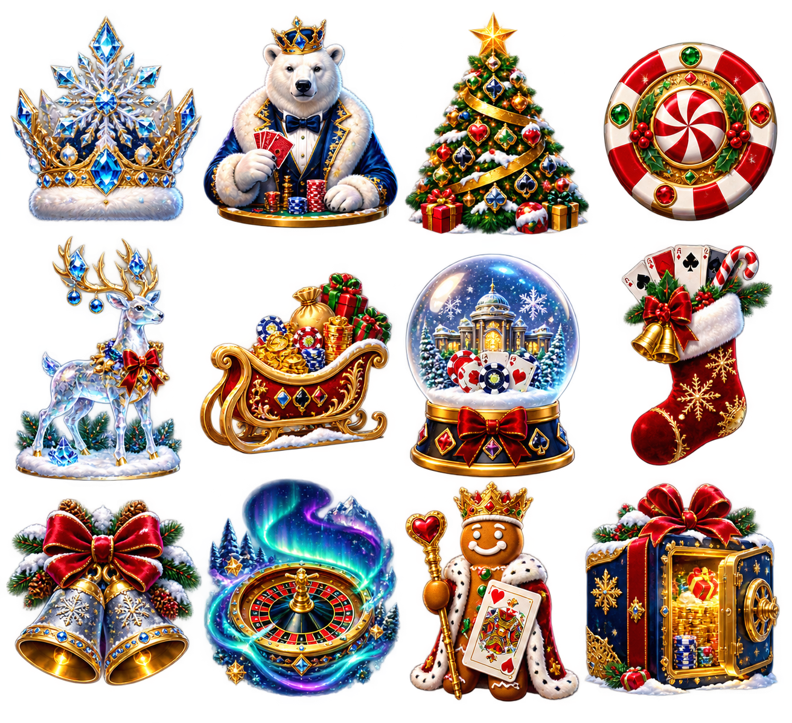

## Emblem collection

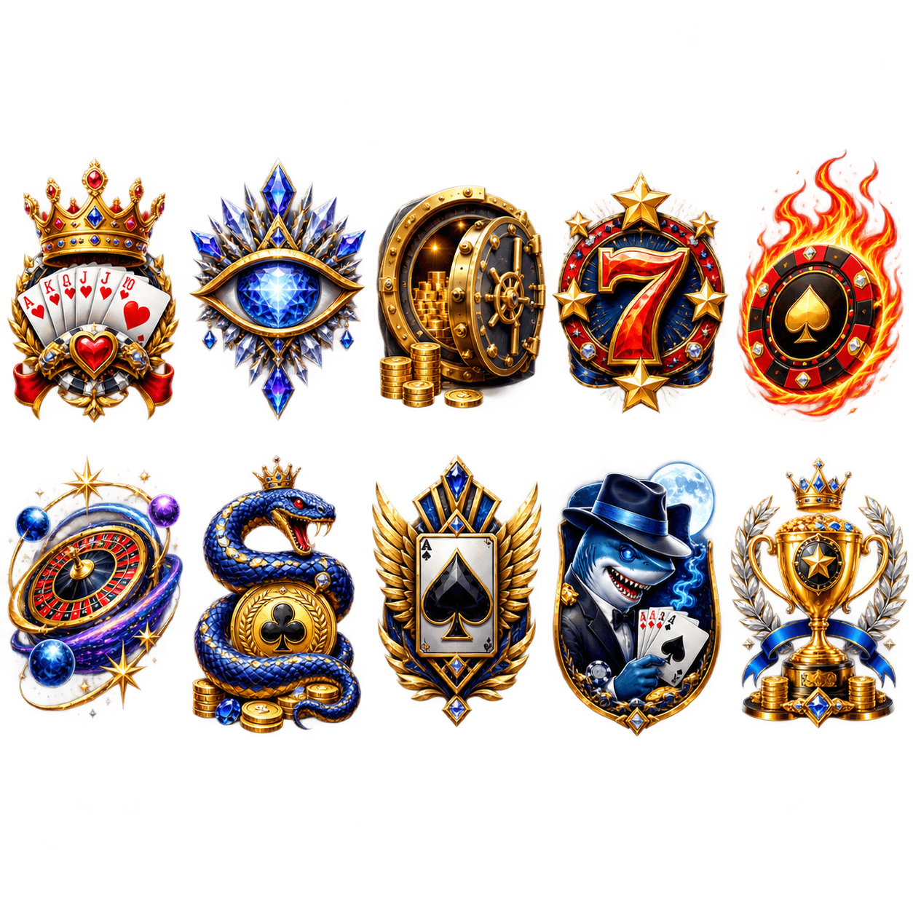

Achievement icons always appear first on the generated profile card. Owned cosmetic emblems appear in a compact grid underneath. The card expands vertically if either collection needs additional rows.

## Illustrated profile scenes

| Neon Penthouse | Sunken Vault | Celestial Casino |
| --- | --- | --- |
| 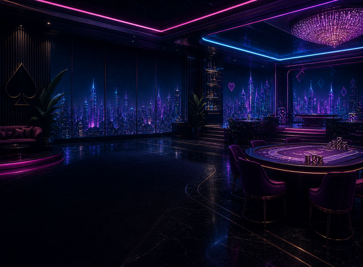 |  | 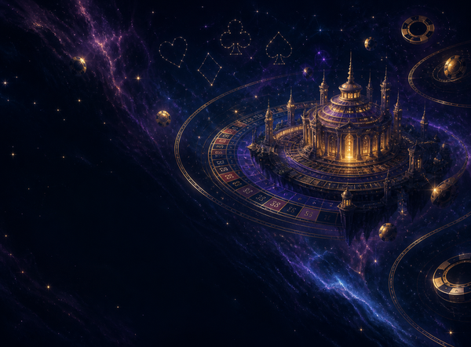 |


Cosmetics are permanent, account-bound unlocks. Changing your look never consumes another Diamond or Customization Token.



Customization Tokens remain the route for editable profile avatars and colors. The Cosmetic Locker is a separate collection of permanent premium looks.

